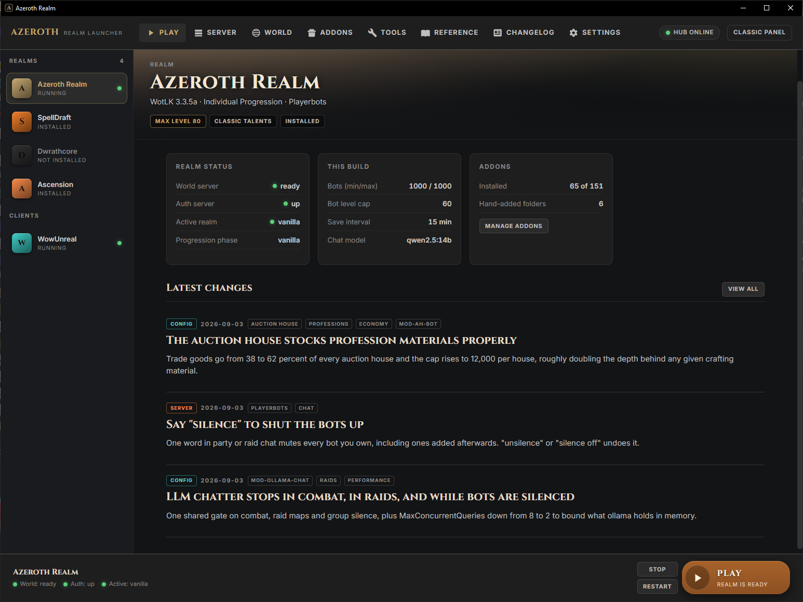
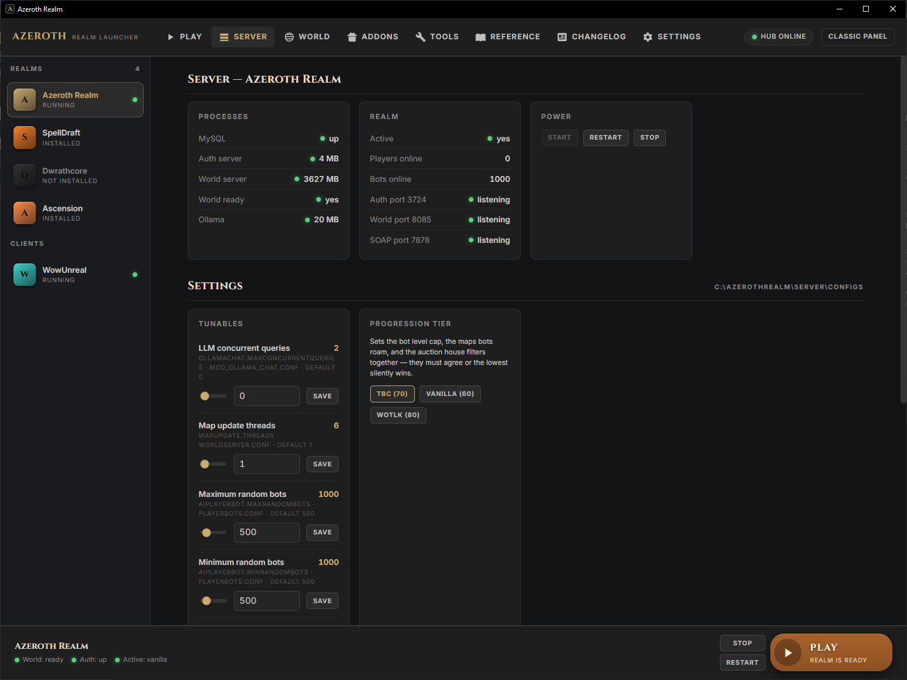
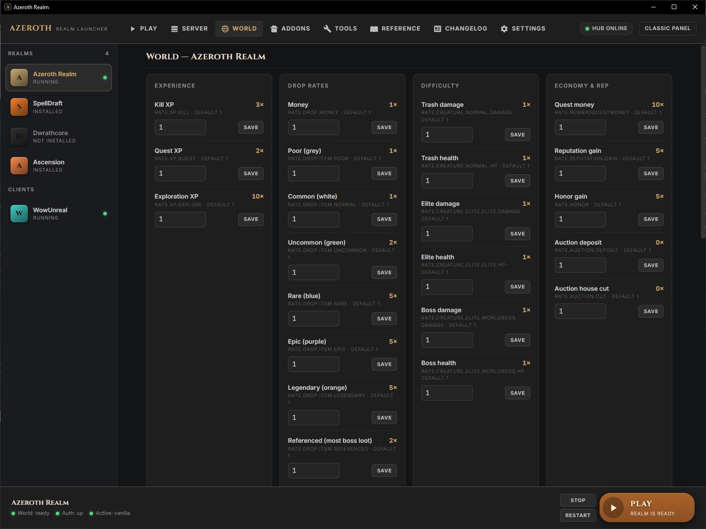
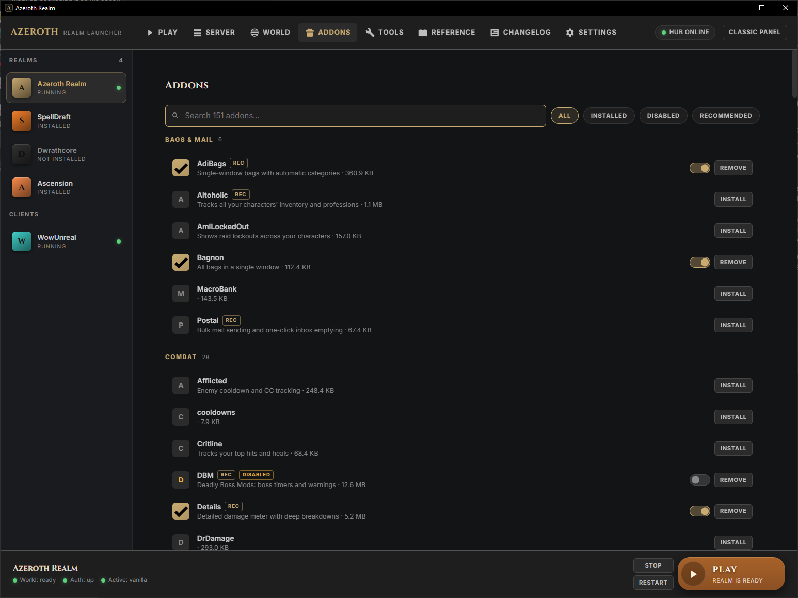
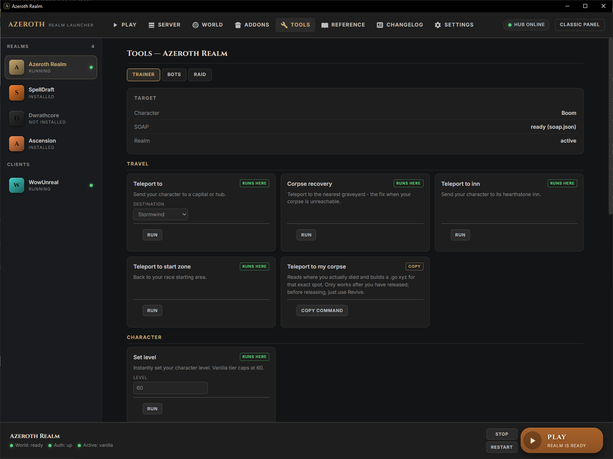
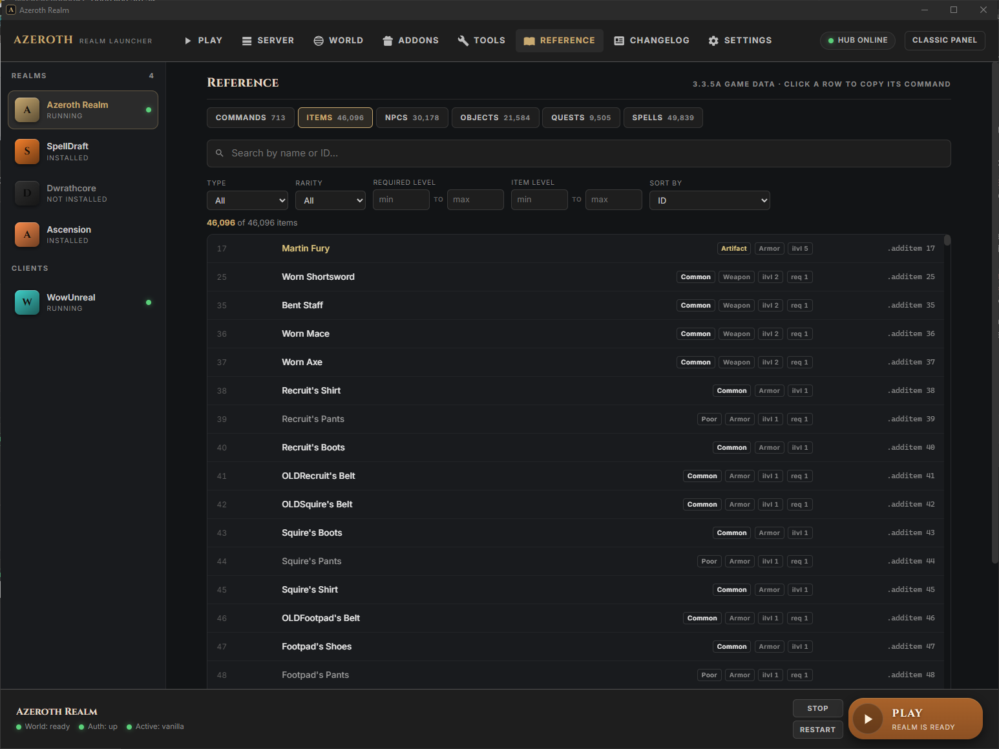
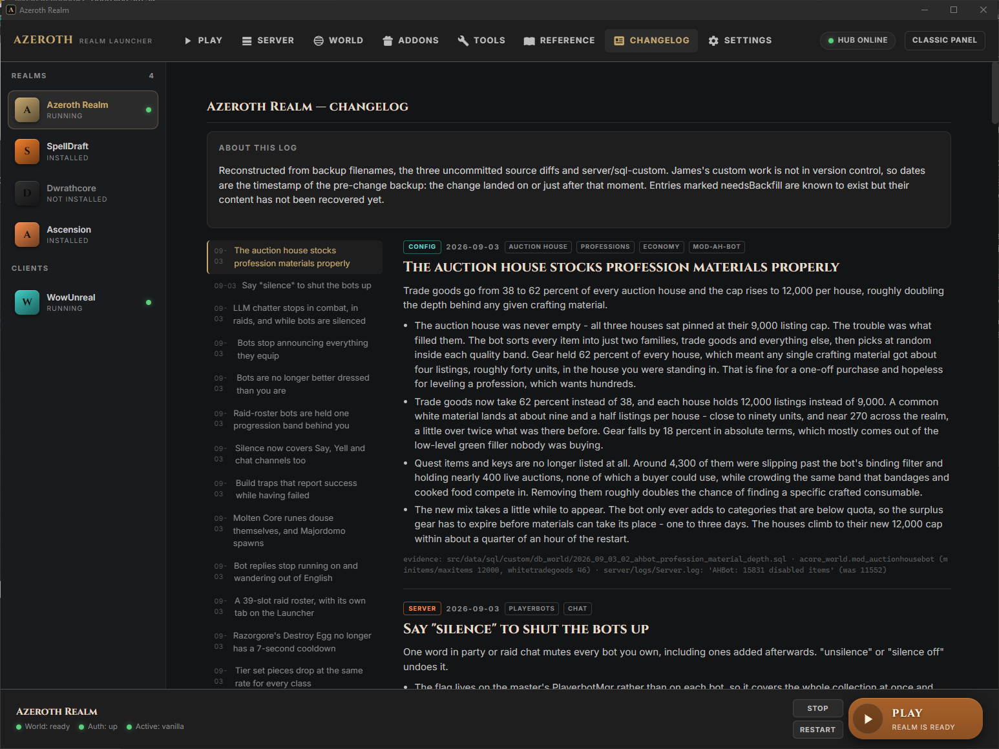

# Azeroth Control

Canonical source for the multi-realm launcher and panel. [Ecosystem and deployment](docs/ECOSYSTEM.md) · [Unified setup](https://github.com/hertigservices/Ascension_preservation/blob/main/docs/SETUP.md).

A local control panel and launcher for your own [AzerothCore](https://www.azerothcore.org/) 3.3.5a server.

Start and stop the realm, tune rates and module settings without hand-editing `.conf` files, install
addons into the client, run GM commands over SOAP, and search the whole 3.3.5a game database — from
one window, on the machine the server runs on.

It is a single Python process using **nothing outside the standard library**. No pip install, no
Node, no Docker required, no build step, no account, and no telemetry. The listener binds
`127.0.0.1` only, and the pages load no fonts, scripts or trackers from anywhere — the panel
works with the network cable out.

*(Two optional extras do want a package, and neither is the panel: the desktop-window wrapper
uses [pywebview](https://pywebview.flowrl.com/) if you want a real window instead of a browser
tab, and the icon generator uses Pillow. Both fail politely to a message when absent.)*

```bash
git clone https://github.com/hertigservices/azeroth-control.git
```

> **Not affiliated with Blizzard Entertainment.** No game client, game data or copyrighted Blizzard
> material is distributed here. You supply your own 3.3.5a client and your own AzerothCore server.

<details>
<summary><b>📋 Copy-paste prompt: have your own AI read this code before you run it</b> — click to expand</summary>

<br>

You are about to run someone else's code against your game server and your database. You should not
take my word that it is safe, and you do not have to read 15,000 lines yourself to check.

Paste the prompt below into Claude Code, Codex, Cursor, Gemini CLI, or whatever agent you use. It
audits the repository against the specific claims this README makes, reports what it found, and only
installs **after** you have read that report and said go.

```text
I want to install "Azeroth Control", a local control panel for an AzerothCore 3.3.5a
WoW server: https://github.com/hertigservices/azeroth-control

Do this in two stages. Do NOT run any of its code during stage 1.

=== STAGE 1: SECURITY AUDIT ===

Clone the repo but do not execute anything from it. Then verify these specific claims
the project makes about itself, and tell me plainly where each one holds or fails:

1. DEPENDENCIES. It claims the panel is Python standard library only, with two
   optional extras: pywebview (desktop window) and Pillow (icon generator).
   List every non-stdlib import in every .py file. Confirm those two are the only
   ones, that both are imported lazily inside a try/except rather than at module
   top level, and that the panel runs without them. Confirm there is no setup.py,
   requirements.txt, pyproject.toml or pip install anywhere.

2. WHAT IT LISTENS ON. It claims the web panel binds 127.0.0.1 only, so nothing on my
   network can reach it. Find the socket bind and confirm the address. Flag any
   0.0.0.0, any empty host string, and any CORS header that would let a web page I
   visit talk to it.

3. WHAT IT SENDS OUT. It claims no telemetry and no phone-home, that the HTML
   pages load no external fonts/scripts/trackers, and that its only outbound
   traffic is (a) downloading addons from URLs listed in
   control/addons_catalog.json when I click install, (b) api.github.com when I
   explicitly rebuild that catalogue, and (c) localhost:11434 for Ollama.
   Find every outbound call (urllib, requests, socket, curl, wget,
   Invoke-WebRequest, git clone) and every external URL in the .html files, and
   tell me the destination of each. Flag anything sending data OUT rather than
   fetching something in, anything contacting a host not in that catalogue or in
   install/versions.json, and any hardcoded public IP address.

4. CREDENTIALS. It reads my MySQL password out of my own worldserver.conf, and
   control/soap.json holds a GM account password in plaintext. Confirm those
   credentials are only ever used to talk to my own local MySQL and my own
   worldserver, are never written to a log, and never leave the machine. Check
   .gitignore actually excludes soap.json and profiles.json so I cannot commit
   them by accident.

5. WHAT IT WRITES AND DELETES. List every file write, move and delete outside the
   repo folder itself. Expected: my server's .conf files, my client's Interface/AddOns
   folder, and my client's Cache. Flag any write to system directories, the registry,
   startup/autorun locations, scheduled tasks, or anything outside those.

6. WHAT IT EXECUTES. List every subprocess/shell invocation and every eval, exec,
   pickle, or dynamic import. Expected: python, powershell, mysql, mysqldump,
   worldserver.exe, authserver.exe, my WoW client. Flag anything that downloads a
   binary and then runs it, and anything that builds a command string from data
   in a JSON file rather than from a fixed list.

7. THE SQL. This thing runs UPDATE and DELETE against my world and character
   databases. Find those statements. Tell me which ones are destructive, whether any
   query interpolates user input into SQL as a string, and whether there is anything
   that could drop or truncate a table.

8. THE WEB PANEL. Look at control/launcher.html and the /api and /v1 handlers.
   Tell me whether any HTTP endpoint takes a filesystem path from the request and
   uses it without constraining it to the repo (a path-traversal read/write), and
   whether any endpoint runs a shell command built from request data.

9. OBFUSCATION. Flag anything base64-encoded, hex-encoded, minified, compiled,
   binary, or otherwise not human-readable, plus any comment that contradicts what
   the code beside it actually does.

Then STOP and give me:
  - a one-line verdict: safe to run / safe with caveats / do not run
  - anything you flagged, with the file and line, ranked by how much it matters
  - anything you could not determine

Do not begin stage 2 until I reply.

=== STAGE 2: INSTALL ===

Only after I say go.

Read AGENTS.md in the repo and follow it. It is a phased runbook with a verification
command and an expected result at each checkpoint. Its version pins are deliberate and
several look like downgrades but are not — install/versions.json gives the reason for
each one. Do not upgrade past them.

- If I already have an AzerothCore server, use Phase A: run install/detect.py to
  generate realms/profiles.json, then install/verify.py, and show me its output.
- If I am starting from nothing, ask me before Phase B — it builds AzerothCore from
  source and that takes a while.

Before you change any file of mine that already exists — a .conf, my AddOns folder,
anything in my database — tell me what you are about to change and wait. Never
overwrite an existing realms/profiles.json.
```

**Reading the report you get back.** Some things are expected and are not findings:

- The panel runs `mysql`, `worldserver.exe` and your WoW client as subprocesses. That is the job.
- It writes to your `.conf` files. That is the World tab.
- `control/soap.json` really does hold a GM password in plaintext — which is why the docs tell you
  to make a throwaway GM account for it instead of using your own.
- `schemas.xmlsoap.org` and `www.w3.org` appear in the SOAP and SVG code as **XML namespace
  identifiers**. They are names, not addresses; nothing fetches them.
- `launcher.html` contains long digit strings that pattern-match as IP addresses. They are SVG
  icon path data.

Anything else your agent flags is worth asking about, and worth [opening an issue](../../issues)
over. If the audit finds something real, I would rather hear it than not.

</details>

---

## Contents

- [Have your AI audit it first](#-copy-paste-prompt-have-your-own-ai-read-this-code-before-you-run-it)
- [What you need](#what-you-need)
- [Install](#install)
- [The tabs](#the-tabs) — Play · Server · World · Addons · Tools · Reference · Changelog
- [Your setup is probably different](#your-setup-is-probably-different)
- [How it fits together](#how-it-fits-together)
- [Security](#security)
- [License](#license)

---

## What you need

| | |
|---|---|
| **OS** | Windows 10 or 11. The process control and tray icon are Win32-specific — see [Other platforms](#other-platforms). |
| **Python** | 3.8 or newer. Standard library only. |
| **A server** | Any AzerothCore 3.3.5a install. It does **not** have to be one this repo built. |
| **A client** | Your own WoW 3.3.5a (build 12340) client, for the Play button. |

Optional, and each one only lights up the features that need it:
[mod-playerbots](https://github.com/mod-playerbots/mod-playerbots) ·
[mod-individual-progression](https://github.com/ZhengPeiRu21/mod-individual-progression) ·
[mod-ah-bot](https://github.com/azerothcore/mod-ah-bot) ·
[mod-ollama-chat](https://github.com/DustinHendrickson/mod-ollama-chat) ·
[mod-autobalance](https://github.com/azerothcore/mod-autobalance)

**Anything you do not have is hidden, not broken.** A tab whose backend reports the module absent is
dropped from the strip rather than shown as a control that would silently miss.

---

## Install

### If you already have an AzerothCore server

```bash
python install/detect.py
```

It reads your `worldserver.conf`, works out where the server, configs, logs and client live, and
writes a `realms/profiles.json` describing your install. Then:

```bash
python control/control.py
```

and open <http://127.0.0.1:8750/launcher>.

### If you are starting from nothing

`install/bootstrap.ps1` walks the whole Windows build: prerequisites at pinned versions, clone,
CMake configure, build, database import, first boot. It is long and it is opinionated about
versions — see [`install/versions.json`](install/versions.json) for what it pins and why.

```powershell
powershell -ExecutionPolicy Bypass -File install\bootstrap.ps1
```

### If you would rather have an AI agent do it

The repo ships [`AGENTS.md`](AGENTS.md): a phased runbook written for a coding agent, with a
verification command and an expected result at every checkpoint, and the version pins stated as
constraints *with their reasons* so the agent does not helpfully upgrade past them. Point
[Claude Code](https://claude.com/claude-code) — or any agent that reads `AGENTS.md` / `CLAUDE.md` —
at a clone and tell it to install the server.

The [copy-paste prompt above](#-copy-paste-prompt-have-your-own-ai-read-this-code-before-you-run-it)
does this, with a security audit of this repository in front of it.

Full walkthrough in [`docs/INSTALL.md`](docs/INSTALL.md).

---

## The tabs

### Play



The landing view: which realm is selected, whether it is up, and one button to get into the game.

The rail on the left lists every realm profile you have declared and every client. Realms are just
entries in `realms/profiles.json`, so a second realm — a test copy, a fork, a different module set —
is a JSON block, not a second install of this panel. Only one runs at a time; switching stops the
running realm gracefully (characters saved) before starting the next.

The three cards summarise the things you actually check before playing: world and auth state, the
bot population and level cap, and how many addons are installed. Below them, the changelog's most
recent entries.

### Server



Process control and the settings that need a restart.

**Processes** is live memory for MySQL, authserver, worldserver and Ollama; **Realm** is the ports,
actually probed rather than assumed, plus who is online. **Power** starts, restarts and stops — the
stop is a graceful `CTRL_BREAK` into `World::StopNow`, which saves every character, not a kill.

**Tunables** edits real `.conf` keys, showing the current value, the file it lives in, and the
default that shipped in the matching `.conf.dist` — so you can always put a value back without
looking it up. **Progression tier** is the multi-file case that makes hand-editing risky: the bot
level cap, the maps bots roam and the auction-house filters live in three different files and must
agree, because the lowest one silently wins.

### World



Every rate on one page: experience, drops by item quality, creature damage and health by rank, and
the economy.

Each row names the underlying config key and its stock default under the label, so the page teaches
the config rather than hiding it. Values apply on the next world restart.

### Addons



A catalogue of WotLK-era addons, installed into the selected realm's client with one click.

Search, filter to what is installed or disabled, and a `REC` badge on the ones worth having.
The toggle is the useful part: it **disables an addon without deleting it**, by sidelining the folder
to `Interface/AddOns.disabled` and moving it back on demand — so you can bisect a broken UI without
re-downloading anything. Folders you added by hand are detected and listed alongside.

### Tools



GM commands as a form instead of a syntax you have to remember.

**Trainer** runs against the live server over SOAP: teleports, corpse recovery, set level, and the
rest. Every card says whether it `RUNS HERE` or is `COPY`-only — some commands must be typed in-world
by a player, and the panel tells you which rather than failing quietly.

**Bots** and **Raid** appear only if you run mod-playerbots and mod-raid-roster. Where a command's
effect depends on config, the relevant gate is shown next to it, so "why did that do nothing" is
answerable on the same screen.

### Reference



The entire 3.3.5a game database, searchable, offline.

46,096 items · 30,178 NPCs · 21,584 objects · 9,505 quests · 49,839 spells · 713 commands — filtered
by type, rarity, required level and item level. Click any row to copy the `.additem` / `.npc add` /
`.go` command for it. Built once from your own DBCs and world database by `tools/rebuild-refdata.py`;
nothing is fetched from the internet and no game data is redistributed here.

### Changelog



A per-realm log of what you changed and why, with the evidence line — the SQL file, config key or
log excerpt that proves it — attached to each entry.

This is the tab people skip and then wish they had. Six months in, "why is the auction house tuned
like that" has an answer instead of a guess. Entries are Markdown files under `realms/changelog/`.

---

## Your setup is probably different

Almost nobody's AzerothCore matches anybody else's. Different ports, a database with a real password,
MySQL as a Windows service or in a container, the server on another box entirely. Three things
handle that:

**1. The panel reads your server's config instead of assuming.** Host, port, user, password and
schema names all come from the `WorldDatabaseInfo` / `LoginDatabaseInfo` / `CharacterDatabaseInfo`
lines in your own `worldserver.conf` — the one place that is true for every install, including a
Docker stack with MySQL on a mapped port. The world port comes from `WorldServerPort` the same way.

**2. Everything else is data in `realms/profiles.json`.** Paths, database names, which controls the
realm supports. See [`templates/profiles.example.json`](templates/profiles.example.json) and
[`docs/CONFIGURATION.md`](docs/CONFIGURATION.md).

**3. If the panel cannot own your processes, it does not pretend to.** Set `serverManaged: false` and
the Server / World / Tools tabs disappear; Play, Addons, Reference and Changelog keep working against
the server you already run, however you run it.

### Docker, Linux, remote servers

`serverManaged: false` is the supported answer today, and it is a real one — the panel is useful as an
addon manager, game-data reference and changelog against any server you can reach.

Full lifecycle control (start/stop/restart) is Windows-process-specific right now. The seam for a
Docker or systemd adapter is narrow and marked: `realms.py` uses exactly two primitives,
`spawn_detached` and `stop_graceful`. A `docker compose start/stop` implementation of that pair is a
genuinely small change, and a welcome PR. It is not shipped half-done, because a lifecycle adapter
that is subtly wrong loses characters.

### Other platforms

The panel core — HTTP, config parsing, database queries, addon management — is portable Python. The
Windows-specific parts are process control (`CTRL_BREAK`), the tray icon and the native window
wrapper. On Linux or macOS today, run it with `serverManaged: false`.

---

## How it fits together

```
control/
  control.py       HTTP listener on 127.0.0.1:8750, process control, config and SQL primitives
  launcher.py      /v1 REST surface: realms, addons, patch jobs, progress as server-sent events
  panel.py         realm-scoped versions of every control, rebased onto the selected profile
  realms.py        profile lifecycle - graceful stop, start, switch
  launcher.html    the entire UI: one file, no build step, no framework
  launcher_app.py  optional native window around the page

realms/profiles.json   the realm registry - the only file describing YOUR install
```

Two design rules worth knowing before you change anything:

- **`control.py` is the single source of truth for what is safe to edit.** `panel.py` rebases its
  tables onto another realm's config directory rather than re-listing them, so the two panels cannot
  drift apart.
- **The frozen `.exe` is a shell.** `launcher_app.py` loads the panel from disk by path and bundles
  none of it, so editing `launcher.html` takes effect on the next window with no rebuild.

Optional native window:

```powershell
tools\appbuild-venv\Scripts\python.exe tools\build-launcher.py
```

---

## Security

The listener binds `127.0.0.1` and nothing else. **Do not expose it.** Its endpoints start and stop
processes, edit server configs and run SQL against your world database — it is a local admin console
with no authentication, by design, because it is reachable only from the machine it runs on.

It never contacts the internet except when you click Install on an addon, which downloads from that
addon's own published URL.

---

## Contributing

Issues and pull requests welcome. The two most useful contributions right now:

- **A process adapter for Docker or systemd** — see the seam described above.
- **Config-key coverage.** `SETTABLE` and `RATES` in `control.py` list what the panel exposes; adding
  a key means adding a row with its bounds, not writing UI.

Please keep the no-dependencies rule. It is the reason this installs in one step.

---

## Credits

Built on the work of the [AzerothCore](https://github.com/azerothcore/azerothcore-wotlk) project and
the module authors linked above. AzerothCore is AGPL-3.0; this panel is a separate program that talks
to it over process control and MySQL, and vendors none of its code.

## License

MIT — see [LICENSE](LICENSE).
